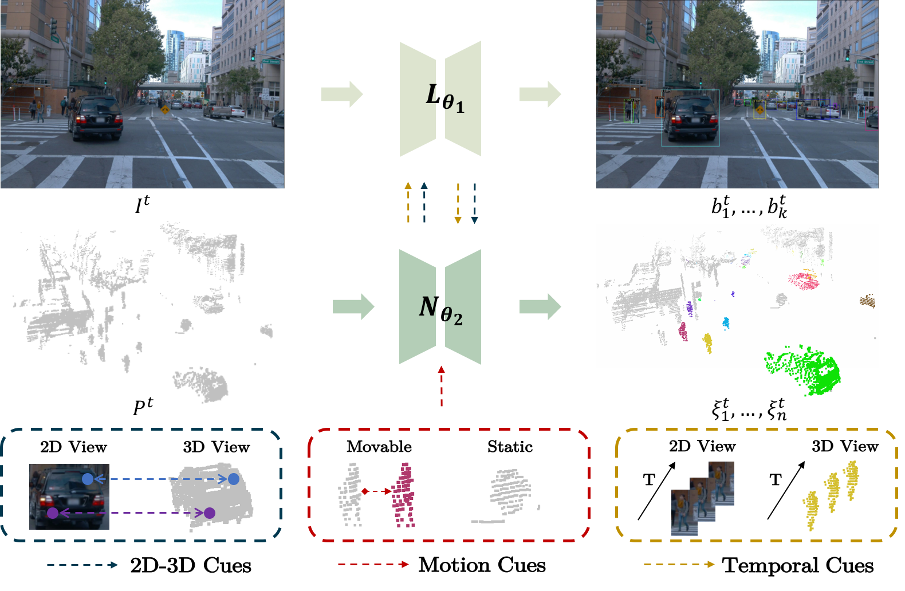
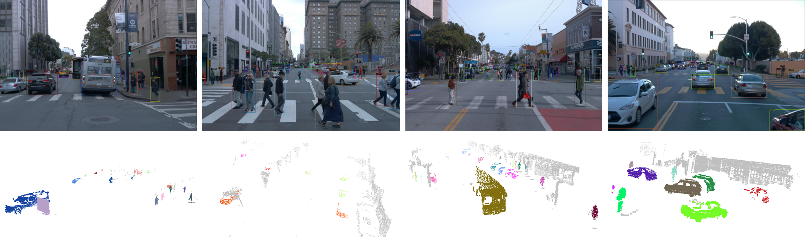

# <center>4D Unsupervised Object Discovery<center>
> [NeurIPS 2022 Spotlight] [**4D Unsupervised Object Discovery**](https://arxiv.org/pdf/2210.04801.pdf).
> [Yuqi Wang](https://robertwyq.github.io), Yuntao Chen, [Zhaoxiang Zhang](https://zhaoxiangzhang.net)


## News
- **[2022/12/1]** https://zhuanlan.zhihu.com/p/588302740
- **[2022/10/10]** Paper released on <https://arxiv.org/pdf/2210.04801.pdf>
- **[2022/9/15]** 🔥*LSMOL* was accepted by NeurIPS 2022.


## Catalog
**The code is not available now, we will release it soon🚀**
- [ ] 3D Instance Segmentation
- [x] 2D Detection
- [x] NSPF for sceneflow estimation
- [x] 3D Instance Initialization Code
- [x] Data Processing Code 
- [x] Initialization


## Abstract
Object discovery is a core task in computer vision. While fast progresses have been made in supervised object detection, its unsupervised counterpart remains largely unexplored. With the growth of data volume, the expensive cost of annotations is the major limitation hindering further study.  Therefore, discovering objects without annotations has great significance. However, this task seems impractical on still-image or point cloud alone due to the lack of discriminative information. Previous studies underlook the crucial temporal information and constraints naturally behind multi-modal inputs. In this paper, we propose 4D unsupervised object discovery, jointly discovering objects from 4D data -- 3D point clouds and 2D RGB images with temporal information. We present the first practical approach for this task by proposing a ClusterNet on 3D point clouds, which is jointly iteratively optimized with a 2D localization network. Extensive experiments on the large-scale Waymo Open Dataset suggest that the localization network and ClusterNet achieve competitive performance on both class-agnostic 2D object detection and 3D instance segmentation, bridging the gap between unsupervised methods and full supervised ones.


## Methods



## Visualization



## Get Started
- [Installation](docs/install.md)
- [Dataset](docs/dataset.md)
- [Sceneflow](docs/sceneflow.md)

## Citation
Please consider citing our work as follows if it is helpful.
```
@article{wang20224d,
  title={4d unsupervised object discovery},
  author={Wang, Yuqi and Chen, Yuntao and ZHANG, ZHAO-XIANG},
  journal={Advances in Neural Information Processing Systems},
  volume={35},
  pages={35563--35575},
  year={2022}
}
```

## Acknowledgement 
Many thanks to the following open-source projects:
* [mmdetection3d](https://github.com/open-mmlab/mmdetection3d)
* [detectron2](https://github.com/facebookresearch/detectron2)  
* [depth_clustering](https://github.com/PRBonn/depth_clustering)
* [Neural_Scene_Flow_Prior](https://github.com/Lilac-Lee/Neural_Scene_Flow_Prior)
